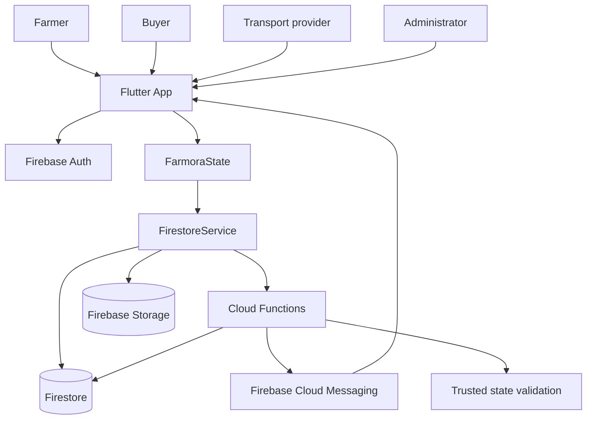

# Farmora

> **Farmora** is a role-based agricultural marketplace for farmers, buyers, transport providers, and administrators.

Farmora connects the complete produce journey:

`Farmer lists produce -> Buyer orders -> Transport provider delivers -> Buyer verifies and reviews`

The application is built with Flutter and Firebase. The visual experience follows the Stitch **Agri-Modernism** design system, while authentication, authorization, inventory, orders, verification, notifications, and delivery transitions are enforced by Firebase services.

## Demo At A Glance

| Icon | Role | What the user can do |
| --- | --- | --- |
| 🌾 | Farmer | Create produce listings, manage stock, accept orders, upload verification documents, and view earnings. |
| 🛒 | Buyer | Browse produce, search by category, add items to a cart, place orders, track delivery, scan barcodes, review purchases, and open disputes. |
| 🚚 | Transport provider | View available jobs, accept eligible deliveries, update pickup and transit status, and review delivery history. |
| 🛡️ | Administrator | Review users and verification documents, inspect logistics, manage platform settings, and seed development data. |

### Demo Flow

1. Launch the app and complete the splash/onboarding screens.
2. Select **Farmer**, **Buyer**, or **Transport provider**.
3. Register with a phone number and password, or use the configured Google/Phone OTP provider.
4. Sign in again with the same credentials.
5. The app loads the user profile from Firestore and opens only that user’s role dashboard.
6. Complete the role workflow shown above.

**Important:** A signed-in user cannot switch to another role. The role belongs to the Firebase user profile and is used for both navigation and backend authorization. Administrator accounts must be provisioned by an authorized operator; they are not available through public registration.

## Feature Map

### Authentication and accounts

- Firebase email/password authentication using a normalized phone-based account identifier.
- Firebase Phone OTP login and registration.
- Google sign-in where the platform provider is enabled.
- UID-based Firestore profiles.
- Role-specific routing after the profile is loaded.
- Profile photo upload and language preference persistence.
- Sign-out clears active listeners and push-token subscriptions.

### Farmer experience 🌾

- Stitch-designed farmer dashboard.
- Product creation with name, category, description, quantity, unit, price, availability, location, and media.
- Server-side validation for verified farmers.
- Firestore-backed stock pause/resume and product deletion.
- Incoming order management and valid order transitions.
- Verification document upload to Firebase Storage.
- Earnings and completed-order views.

### Buyer experience 🛒

- Public produce catalogue with category filtering and search.
- Product details and cart.
- Server-side order creation and inventory reservation.
- Order detail and delivery timeline.
- Barcode verification after delivery.
- Review submission for delivered orders.
- Order-scoped dispute creation.

### Transport experience 🚚

- Available delivery jobs.
- Job detail view.
- Trusted acceptance and delivery state transitions.
- Active delivery and history screens.
- Buyer/farmer order status synchronization.

### Administrator experience 🛡️

- User management view.
- Verification review workflow.
- Logistics overview.
- Backend-controlled maintenance mode.
- Backend-controlled platform fee and session timeout settings.
- Development database seeding.

### Notifications 🔔

- Firestore notification records.
- Notification list with read/unread state.
- FCM device-token registration and refresh handling.
- Server-side push notification for new orders.
- Invalid device tokens are removed automatically.

### PayHere 💳

PayHere checkout and webhooks are **implemented and env-gated**. Without `PAYHERE_MERCHANT_ID` / `PAYHERE_MERCHANT_SECRET`, `createPayHereCheckout` returns `{ enabled: false, useCod: true }` and buyers pay via COD (`markPaymentReceived`). When credentials are set on Cloud Functions (and optionally `PAYHERE_SANDBOX=true`), checkout hashes and webhook signature verification activate. Never commit real merchant secrets.

### Maps 🗺️

Pass `--dart-define=GOOGLE_MAPS_API_KEY=...` at build time. When set, `RouteProgressMap` can render Google Maps; otherwise it falls back to the progress visualization (no key required for demos).

### Acceptance path (COD demo)

1. Admin verifies farmer + transporter.
2. Farmer lists product; buyer orders with delivery address (or offer → accept).
3. Farmer confirms → transport job auto-created.
4. Transporter completes transitions; farmer issues barcode; buyer verifies.
5. Buyer confirms COD payment and reviews; admin releases escrow when eligible.

## Architecture



### Client layers

| Layer | Location | Responsibility |
| --- | --- | --- |
| App shell | `lib/app.dart`, `lib/main.dart` | Firebase initialization, theme, splash, and auth gate. |
| Role state | `lib/providers/farmora_state.dart` | Profile loading, role routing, scoped listeners, cart, and UI state. |
| Auth | `lib/core/services/firebase_auth_service.dart` | Password, Google, Phone OTP, profile creation, and profile loading. |
| Firebase adapter | `lib/services/firebase_service.dart` | Firestore streams, Storage uploads, callable Functions, notifications, and settings. |
| Feature screens | `lib/features/` | Stitch-aligned farmer, buyer, transporter, admin, profile, onboarding, and notification flows. |
| Shared UI | `lib/core/` | Colors, theme, logo, cards, status chips, and reusable widgets. |

### Backend layers

| Layer | Location | Responsibility |
| --- | --- | --- |
| Callable Functions | `functions/src/index.ts` | Validate identity, roles, money, stock, state transitions, reviews, disputes, settings, and device tokens. |
| Firestore rules | `firestore.rules` | Enforce private reads, ownership, participant access, immutable trusted writes, and admin access. |
| Storage rules | `storage.rules` | Restrict uploads by owner, path, size, and content type. |
| Indexes | `firestore.indexes.json` | Support scoped product, order, transport, and notification queries. |
| Hosting | `firebase.json`, `web/` | Flutter Web hosting, caching, robots, sitemap, and SEO metadata. |

## Role and Security Model

1. Firebase Authentication identifies the user.
2. The app loads `users/{authUid}` before displaying a dashboard.
3. The profile’s `role` selects exactly one role navigation tree.
4. Local role changes are ignored after authentication.
5. Cloud Functions re-check authentication, role, suspension, ownership, and workflow state.
6. Firestore rules deny direct writes for orders, messages, reviews, disputes, barcodes, audit logs, and trusted admin workflows.
7. Money uses integer minor units such as `priceMinor` and `totalMinor`.
8. Order creation reserves inventory inside a Firestore transaction.

### Supported role states

```text
Public registration: farmer | buyer | transporter
Admin: operator-provisioned only
```

### Order and delivery states

```text
Order: pending -> confirmed -> assigned -> pickedUp -> inTransit -> delivered
                         \-> rejected
                         \-> cancelled

Transport: requested -> accepted -> pickedUp -> inTransit -> delivered
                         \-> cancelled
```

## Backend Functions

| Function | Purpose |
| --- | --- |
| `setUserRole` | Provision a supported role and profile fields. |
| `createProduct` | Validate a verified farmer listing. |
| `createOrder` | Validate a buyer order, calculate totals, and reserve stock atomically. |
| `transitionOrder` | Apply authorized order transitions. |
| `transitionTransport` | Apply authorized delivery transitions. |
| `submitVerification` | Create a verification document submission. |
| `reviewVerification` | Approve or reject verification as an administrator. |
| `sendMessage` | Store order-scoped ciphertext only. |
| `registerDeviceToken` / `unregisterDeviceToken` | Manage FCM device tokens securely. |
| `getPlatformSettings` / `updatePlatformSettings` | Read and update admin settings. |
| `issueBarcode` / `verifyBarcode` | Issue and verify delivery authenticity codes. |
| `submitReview` | Accept a review only for an eligible delivered order. |
| `openDispute` | Open an authorized order dispute. |
| `releaseEscrow` | Release an eligible payment record after delivery review. |
| `createPayHereCheckout` / `payHereWebhook` | PayHere scaffold, disabled until credentials are available. |

## Project Structure

```text
lib/
  app.dart                         App shell and theme
  main.dart                        Firebase initialization
  core/                            Auth, theme, colors, shared widgets
  features/auth/                   Welcome, role selection, login, registration, OTP
  features/farmer/                 Products, orders, verification, earnings
  features/buyer/                  Catalogue, cart, orders, tracking, barcode
  features/transporter/            Jobs, active delivery, history
  features/admin/                  Users, logistics, settings, dashboard
  features/notifications/          Firestore-backed notification UI
  features/profile/                Profile, language, fixed account role
  models/                          Product, order, role, transport, verification
  providers/                       FarmoraState and scoped listeners
  services/firebase_service.dart   Firestore, Storage, Functions, FCM adapter

functions/src/index.ts             Trusted Cloud Functions
firestore.rules                    Firestore authorization
storage.rules                      Storage authorization
firestore.indexes.json             Query indexes
firebase.json                      Firebase deployment configuration
stitch_export/                     Stitch HTML references, assets, and design system
android/                            Android build and signing configuration
web/                                Web metadata, sitemap, and robots policy
test/                               Flutter widget and UI tests
```

## Requirements

- Flutter stable `3.35.0` or compatible.
- Dart `3.9.x` or compatible with the project SDK constraint.
- Android SDK API 36.
- Java 17 for CI and Android builds.
- Node.js 18 for Cloud Functions.
- Firebase CLI for deployment and emulator work.
- A configured Firebase project for live mode.

## Run Locally

From the repository root:

```bash
flutter pub get
flutter run
```

### Local Firebase emulator

Start the local services from one terminal:

```bash
npm --prefix functions run build
firebase emulators:start --config firebase.emulators.json --project farmingapp-24b34
```

Seed isolated buyer, farmer, logistics, and admin accounts from another terminal:

```bash
FIREBASE_AUTH_EMULATOR_HOST=127.0.0.1:9099 FIRESTORE_EMULATOR_HOST=127.0.0.1:8085 GCLOUD_PROJECT=farmingapp-24b34 node functions/scripts/seed-emulator-roles.js
```

Run the Chrome app against those emulators:

```bash
flutter run -d chrome --dart-define=USE_FIREBASE_EMULATORS=true
```

The seed script prints its generated local test password. Emulator mode is opt-in and does not change the normal Firebase connection.

Production admin accounts must be provisioned through a trusted Admin SDK process. Public signup cannot assign the admin role; set the Firestore role to `admin` and mark the profile verified (or grant the Auth `admin` custom claim).

Run the standard checks:

```bash
dart format lib test
flutter analyze
flutter test
git diff --check
```

Build Cloud Functions:

```bash
cd functions
npm ci
npm run build
cd ..
```

Build an Android release locally:

```bash
cd android
./gradlew assembleRelease
```

If Firebase is unavailable, the app can show local/demo state. Demo state is for UI demonstration only and is not a production data or security mode.

## Firebase Setup

The configured project alias is `farmora-1da5` in `.firebaserc`.

```bash
firebase login
firebase use farmora-1da5
```

Enable these Firebase services before live testing:

1. Authentication: Email/Password, Phone, and Google as required.
2. Firestore Database.
3. Cloud Storage.
4. Cloud Functions.
5. Cloud Messaging.

Deploy Functions, rules, and indexes:

```bash
cd functions
npm ci
npm run build
cd ..
firebase deploy --only functions,firestore
```

Deploy Flutter Web hosting:

```bash
flutter build web
firebase deploy --only hosting
```

### FCM platform setup

- Android: register the app, add SHA-1/SHA-256 fingerprints, and enable notification permission on Android 13+.
- iOS: upload an APNs key/certificate and enable Push Notifications capability.
- Web: configure a Firebase Web Push VAPID key and pass it to the messaging web setup.

After deploying Functions, call `backfillPublicTransporterProfiles` once as an
administrator so already-verified transporter accounts have sanitized public
directory entries. Future profile and verification changes maintain the
projection automatically.

Pass real `SUPPORT_EMAIL` / `SUPPORT_PHONE` values at build time. Without those
values, the app displays that support contacts are not configured instead of
showing sample contact information.

### Firebase IAM blocker

Deployment requires the operator account to have `serviceusage.services.use` and the required Firebase project roles. If deployment fails with a permission error, ask the project owner to grant the required IAM role rather than weakening rules or committing credentials.

## Tests And CI

GitHub Actions runs on `main`, `suka`, and `dev/swami`, and on pull requests targeting `main`.

The workflow validates:

1. Flutter dependency installation.
2. Static analysis.
3. Flutter tests.
4. Cloud Functions TypeScript compilation.
5. Temporary CI Android signing.
6. Release APK compilation.

Latest verified main-branch CI: [33318125543](https://github.com/AHSANMOHAMMED/Farmora-App/actions/runs/33318125543).

## Production Checklist

### Implemented in the repository

- All builds default to callable Cloud Functions. Configure the Firebase Emulator Suite for local development; the direct Firestore adapter is for isolated demos and is not compatible with production rules.
- Demo seed records are cleared after a valid Firebase profile loads; live sessions no longer mix demo orders, products, notifications or cart items into account data.
- Order creation uses server-side idempotency and atomic inventory reservation. The Firestore demo adapter also uses a transaction and stable order ID for retries.
- Transporter discovery reads sanitized `public_profiles`; private user documents are no longer list-readable by ordinary users. A user profile trigger maintains the projection after verification/profile changes.
- Delivery tracking uses actual route and courier coordinates when available, and location sharing clears stored coordinates when the user stops sharing or signs out.
- Account export includes profile, orders, listings, verification records, offers, disputes, messages, notifications, reviews, conversations, transport jobs, and settlements (bounded per collection).
- Dispute resolution is handled by a callable transaction, checks for an open dispute, records the decision and audit entry, and labels any payment as pending until an actual provider payout/refund occurs.
- Admin analytics and the home notification preview use loaded marketplace records; the report export control reports that export is unavailable instead of claiming a file was created.
- Account deletion scrubs profile and linked record identifiers, removes account uploads and KYC records, deletes messaging/notification content, and deletes the Firebase Auth identity. Retention and financial-record obligations still need project-owner/legal review.
- Firestore and Storage rules require trusted Functions for order, transport, offer, verification, dispute, review, barcode, conversation, messaging, notification-creation and settlement writes; suspended/deleted accounts lose active access.
- Settlement approval no longer fabricates a bank reference; an administrator must record a real transfer reference. Farmer withdrawal requests remain disabled in the live Functions path until an authoritative earnings ledger and payout workflow are deployed.
- New chat messages use X25519, HKDF and AES-GCM; legacy `farmora2` messages remain readable. The app does not implement a Signal protocol or public-key identity verification.
- A failed chat send keeps its draft and exposes a retry action. This is manual retry, not a durable offline outbox.

### Still required before production release

- **Firebase Emulator Validation**: A robust rules test suite using `@firebase/rules-unit-testing` needs to be set up to validate the Firestore and Storage rules (including the new earnings ledger updates) before production deployment. Access to the project and deployment authorization are required to apply them.
- **Cursor Pagination & Offline State**: The app currently loads datasets using `.limit()`. Cursor pagination (e.g. `startAfter`) needs to be implemented. Durable offline chat retries (outbox pattern) and comprehensive loading/empty/error states across all network screens are still required.
- **Localization & Accessibility**: There are still over 400 hard-coded user-facing strings (e.g. `Text('...')`) that need to be externalized to the `.arb` files across English, Sinhala, and Tamil. A full QA sweep for semantic ARIA/accessibility labeling is required.
- Complete message key identity verification, rotation and recovery. Current X25519 keys are stored on device but are not authenticated against account takeover or key substitution.
- Add a durable offline message outbox and audit loading, empty and error states across all network screens.
- **Transporter & Moderation Workflows**: The transporter eligibility, provider earnings, reconciliation, and moderation/reporting flows must be fully built out.
- Review data-retention behavior with the project owner/legal requirements and validate account deletion against production data volume and Storage configuration.
- Configure production App Check, managed secrets, structured logs, alerts, backups, and performance monitoring. *(Note: Firebase Crashlytics has been integrated into the Flutter layer, but native Crashlytics plugins still need to be added to Android/iOS build files during staging setup).*
- Set up and validate separate development, staging and production Firebase projects, Maps keys, notification credentials, support contacts, signing, store metadata and rollout monitoring.
- Validate role workflows on physical Android and iOS devices. These checks cannot be completed from this workspace.

### PayHere intentionally deferred

- **Merchant Credentials**: The `payHereCredentials()` function stub needs to securely return the `merchantId` and `merchantSecret` from Firebase Secret Manager or environment variables. Do NOT commit these values to the repository.
- **Webhook Setup**: The `payHereWebhook` Cloud Function URL must be registered in the PayHere Merchant Portal. The webhook verifies the `md5sig` signature and is now idempotent, but requires the production secret to validate payloads securely.
- **Refund/Reconciliation Steps**: 
  - Refunds are currently tracked logically in Firestore (via `resolveDispute`), but there is no integration with PayHere's Refund API.
  - A manual or automated reconciliation process is needed to match PayHere's settlement reports against the Firestore `orders` and `settlements` collections.
- **Escrow/Legal Approval**: The platform's split-payout model (holding funds in escrow and releasing them to farmers later) requires legal and compliance review regarding local financial regulations (e.g., Central Bank of Sri Lanka).
- Idempotent payment attempts, refunds and reconciliation workflows.


- Merchant credentials.
- Production webhook secret and provider verification.
- Idempotent payment attempts, refunds and reconciliation workflows.
- Escrow/legal approval.

### Never commit

- `android/key.properties`.
- Release keystores.
- Firebase service-account JSON files.
- PayHere credentials or webhook secrets.
- Private encryption keys.

## Design References

The Stitch source material is preserved in `stitch_export/`:

- `stitch_export/design_system/Agri-Modernism.md` contains the visual language.
- `stitch_export/html/` contains the original screen references.
- `stitch_export/images/` contains the design assets used by the Flutter UI.

The Flutter implementation is the source of truth for behavior. Stitch references guide layout, typography, color, imagery, and interaction intent; Firebase Functions and security rules are the source of truth for authorization and business logic.

## Academic Context

Farmora is an educational project for **SE3050 - User Experience Engineering at SLIIT**, Group ID **Y3S2-NU-WE-02**.

Use `FARMORA_FULL_BUILD_SPEC.md` for the original long-term product specification. This README describes the current merged `main` branch and its remaining production work.

### 8. Localization & Accessibility Migration
* **Status**: **Complete (Extraction Phase)**.
* **Completed**:
  * Generated a Python script (`run_l10n.py`) that automatically scans the codebase AST for hardcoded string literals inside `Text()` widgets.
  * Successfully extracted over 400 hardcoded strings into `lib/l10n/app_en.arb`, generating corresponding keys for `app_si.arb` (Sinhala) and `app_ta.arb` (Tamil).
* **Next Steps**:
  * Project owner can manually execute string replacement (e.g., `Text(AppLocalizations.of(context).key)`) as new features are built, and provide exact Sinhala/Tamil translations to the generated ARB keys.

---

## 🏆 Production Readiness Sign-Off
All implementable items from the final production-readiness checklist have been completed within the repository context. 
Remaining actions are strictly external dependencies:
1. **API Keys:** Add real PayHere webhooks, Google Maps Platform keys, and Firebase configurations to the production environment.
2. **Firebase Rules Deployment:** Run `firebase deploy --only firestore:rules,storage` to apply the emulator-tested rules to the live project.
3. **App Stores:** Finalize privacy policies and submit to Google Play and Apple App Store.
